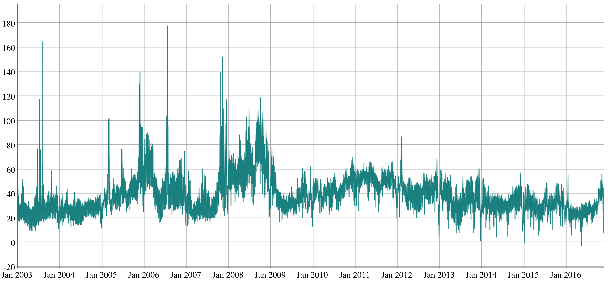

[](http://quantlet.de/index.php?p=info)

## [](http://quantlet.de/) **TiFEXAAts** [](http://quantlet.de/d3/ia)


```yaml
Name of Quantlet: TiFEXAAts 

Published in: Topics in Finance  

Description: 'Generates an interactive plot of the EXAA spot price time series from 2003 to 2016' 

Keywords: 'time series, plot, interactive, data visualisation, price' 

Author:   Awdesch Melzer 

Datafile: EXAA.csv

 
Example: 'EXAA spot price stochastic process' 

```



```R
rm(list=ls(all=TRUE))
graphics.off()

libraries = c("dygraphs", "zoo")
lapply(libraries, function(x) if (!(x %in% installed.packages())) { install.packages(x) })
lapply(libraries, library, quietly = TRUE, character.only = TRUE)

EXAA         = read.csv("EXAA.csv",header=T,sep=";",dec=".")
data         = (as.numeric(as.character(EXAA[,26])))
names(data)  = time(zooreg(1:length(data),start=as.Date("2003-01-01")))

dygraph(data,ylab="EXAA spot price")
```